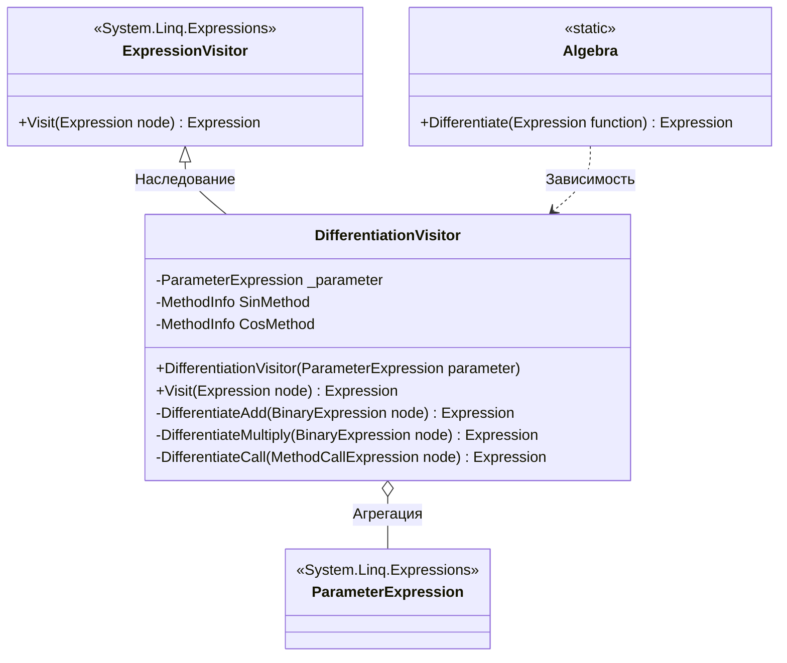

# Практика: Дифференцирование

## 1. Описание предметной области и сущностей
Данный код предназначен для дифферинцирования математических функций.    
**Algebra** - класс, который принимает лямбда выражения, извлекает из него переменную дифференцирования и запускает процесс обхода деревьев    
**DifferentiationVisitor** - класс, который занимается рекурсивным обходом узлов дерева выражений    
## 2. Диаграмма классов (Mermaid)

