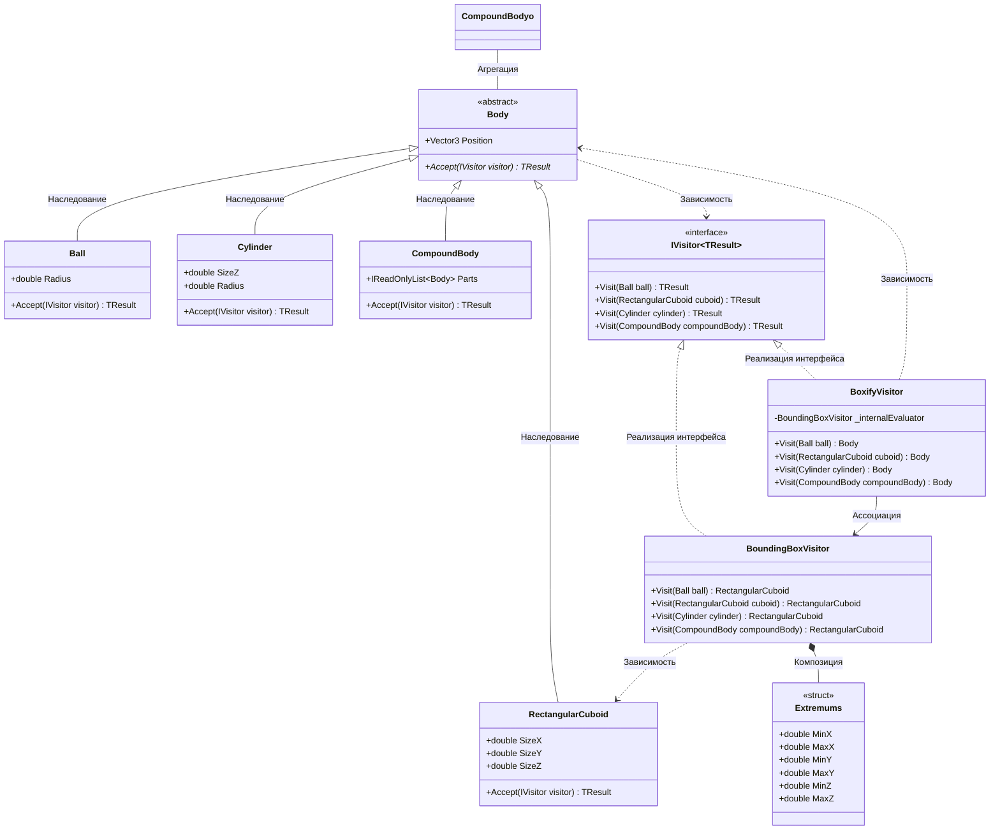

# Практика: Геометрия-2

## 1. Описание предметной области и сущностей
Эта программа представляет собой конструктор, который работает с объёмными фигурами. Он расчитывает размеры и упаковывает эти
объекты    
**body** - класс-родитель, который задаёт логику для всех трехмерных объектов. Содержит метод для посетителя        
**IVisitor<out TResult>** - интерфейс, который содержит в себе все геометрические типы, которые представлены в коде    
**Ball, RectangularCuboid, Cylinder, CompoundBody** - классы геометрических фигур, в которых содержаться их свойства      
**BoundingBoxVisitor** - класс, который вычисляет ограничивающий параллелепипед       
**BoxifyVisitor** - класс, который превращает сложные тела в упрощенные коробки    

## 2. Диаграмма классов (Mermaid)

