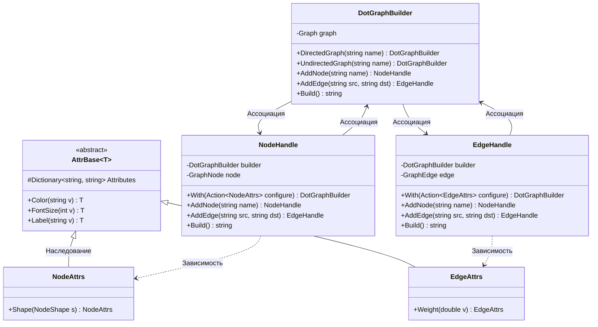

# Практика: GraphViz

## 1. Описание предметной области и сущностей
Данный проект представляет собой библиотеку для построения графов, написанную с помощью Fluent Api    
**DotGraphBuilder** - класс, который отвечает за инизиализацию структуры графа. Является точкой входа для добавления элементов графа и генерации DOT    
**NodeHandle** и **EdgeHandle** - классы, который предоставляют доступ к объектам графа    
**AttrBase<T>** - класс, который отвечает за логику хранения и установки атрибутов    
**NodeAttrs** и **EdgeAttrs** - классы, которые содержат расширяющие методы    
## 2. Диаграмма классов (Mermaid)

