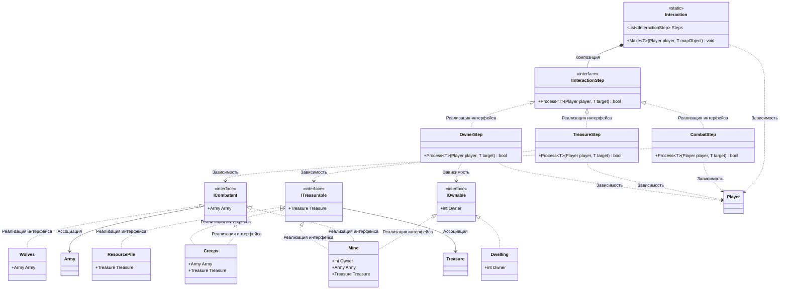

# Практика: HoMM

## 1. Описание предметной области и сущностей
Игрок выполняет роль главного героя, который перемещается по карте для захвата объектов и ресурсов. Игрок может умерет. 
Каждый игрок имеет свой Id.    
**IOwnable** — интерфейс объектов, которые могут иметь владельца (можно захватить)      
**ICombatant** — интерфейс объектов, обладающих армией (с ними можно сразиться)       
**ITreasurable** — интерфейс объектов, содержащих внутри себя сокровища/ресурсы     
**Player** — класс игрока. Содержит уникальный идентификатор Id, а также методы для проверки исхода боя, сбора ресурсов и гибели        
**Army** — класс войск        
**Treasure** — класс ресурсов    
**Interaction** — класс, запускающий поочередную цепочку шагов взаимодействия игрока с объектом на карте    
**IInteractionStep** — интерфейс одного шага взаимодействия    
**Dwelling** — класс жилища    
**Mine** — класс шахты. Имеет охрану, приносит ресурсы и может быть захвачена    
**Creeps** — класс нейтральных монстров, которые охраняют сокровища    
**Wolves** — класс волков, с которыми можно только сразиться (не охраняют ресурсы, нельзя захватить)    
**ResourcePile** — куча ресурсов, которую можно собрать без боя    

## 2. Диаграмма классов (Mermaid)

