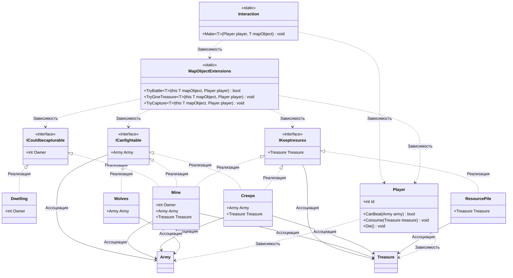

# Практика: HoMM

## 1. Описание предметной области и сущностей
Игрок выполняет роль главного герия, который перемещается по карте для захвата объектов и ресурсов. Игрок может умерет. 
Каждый игрок имеет свой Id.    
**ICouldbecapturable** — интерфейс объектов, которые можно захватить    
**ICanfightable** — интерфейс объектов, которые защищает армия    
**IKeeptresures** — интерфейс объектов, которые содержат сокровища    
**Player** — класс игрока. Содержит методы проверкуи исхода боя, сбора ресурсов и гибели      
**Army** — класс войск    
**Treasure** — класс ресурсов    
**MapObjectExtensions** - класс, который содержит методы расширения для взаимодействия    
**Interaction** — класс, в котором выполняется логика взаимодействия      
**Dwelling** - класс жилища, которое можно захватить      
**Mine**  — класс шахты, которая имеет охрану, ресурсы и возможность захвата    
**Creeps** - класс монстров, которые содержат сокровища и имеют армию    
**Wolves** - класс волков, м ними можно тоько сразиться    
**ResourcePile** - куча ресурсов, которую можно собрать не сражаясь    

## 2. Диаграмма классов (Mermaid)

