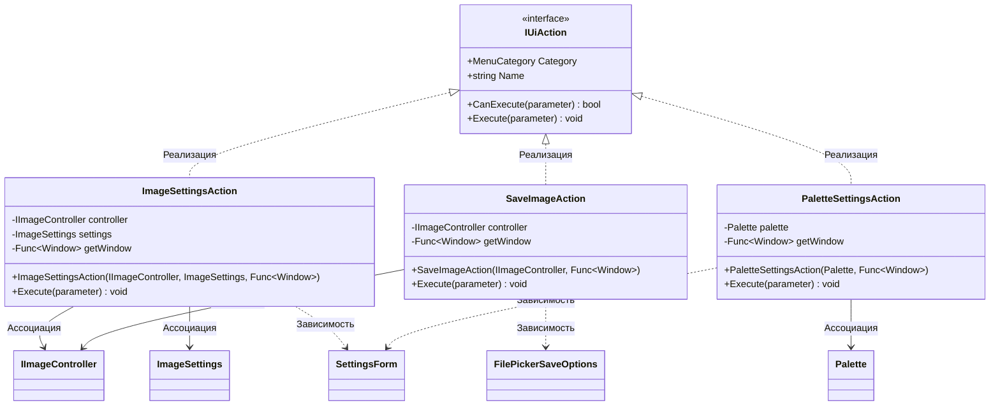

# Практика: Fractal Painter. DIP

## 1. Описание предметной области и сущностей
Данный проект представляет собой оконное приложение для генерации и настройки фрактальных изображений. Основными сущностями являются действие, инкапсулирующие логику обработки событий
через интерфейс IUAction.

## 2. Диаграмма классов (Mermaid)

