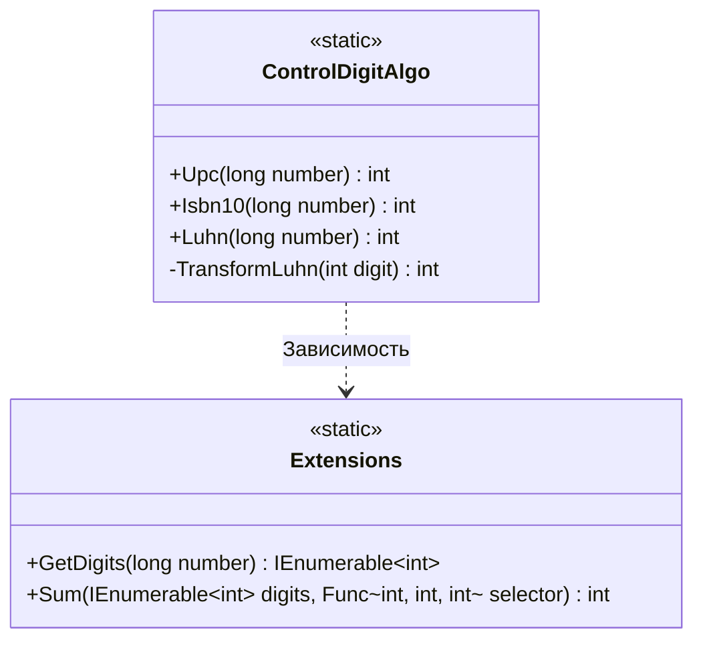

# Практика: Контрольный разряд

## 1. Описание предметной области и сущностей
Данный проект представляет собой скрипт, скрипт который валидирует серийные номера.    
**ControlDigitAlgo** - класс, в который отвечает за реализацию алгоритмов валидации    
**Extensions** - класс, отвечает за работу с числами: разбиение на разряды и агрегация    
****
## 2. Диаграмма классов (Mermaid)

