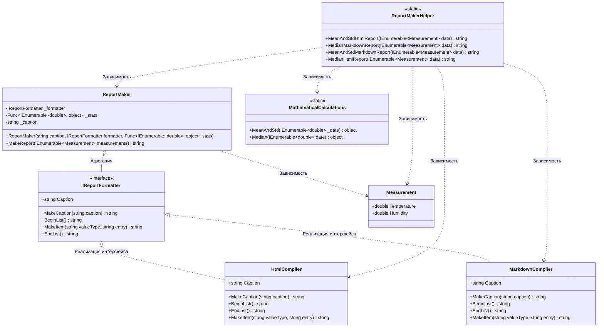

# Практика: Генератор отчетов

## 1. Описание предметной области и сущностей
Данный проект представляет собой модуль для автоматической генерации отчётов на основе собранных данных.    
**IReportFormatter** - интерфейс, который определеяет методы для формирования отчёта, изолирует логику вычислений и форматирования отчёта    
**HtmlCompiler** - класс, который реализует интерфейс IReportFormatter и отвечает за генерацию html разметки в отчёте       
**MarkdownCompiler** - класс, который реализует интерфейс IReportFormatter и отвечает за генерацию markdown разметки в отчёте          
**ReportMaker** - класс, который является основным. Объединяет все процессы для создания отчёта    
**MathematicalCalculations** - класс, который объединяет в себе методы для математических вычислений    
**ReportMakerHelper** - класс, который объединяет в себе все методы для создания отчётов    
## 2. Диаграмма классов (Mermaid)

