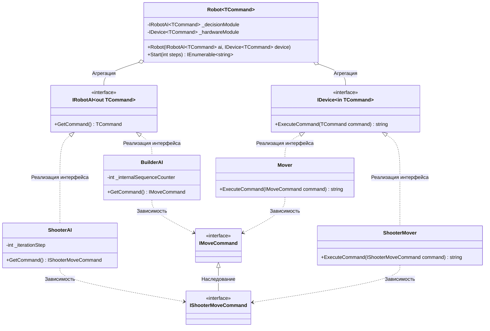

# Практика: Роботы

## 1. Описание предметной области и сущностей
Данная программа реализует архитектуру для управления роботами с помощью generics, ковариантности и контрвариантности    
**IMoveCommand** - интерфейс, который описывает структуру для базового перемещения    
**IShooterMoveCommand** - интерфейс, который дополняет структуру базового перемещения, добавляя скрытность    
**IRobotAI<out TCommand>** - интерфейс с маркером out, который отправляет готовые команды через метод GetCommand()        
**IDevice<in TCommand>** - интерфейс с маркером in, который принимает команды на исполнение в метод ExecuteCommand()    
**BuilderAI** - класс, который отвечает за ии строительного работа. Генерирует стандартные команды    
**ShooterAI** - класс, который отвечает за ии боевого робота. Расчитывает шаги и генерирует сложные команды    
**Mover** - класс, который отвечает за движение. Считывает координаты из IMoveCommand и переводит в формат  MOV X, Y    
**ShooterMover** - класс, который отвечает за боевой модуль. Обрабатывает команды IShooterMoveCommand    
**Robot<TCommand>** - класс, который объединяет ии и устройства в единую систему    
## 2. Диаграмма классов (Mermaid)

