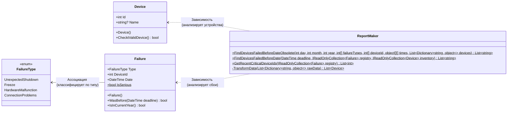

# Практика: Сбои

## 1. Описание предметной области и сущностей
Данная система предназначена для анализа сбоев на различных устройств и формированию отчётов по критическим сбоям.    
**Failure** - класс, который содержит в себе тип сбоя, устройство и дату. Сам определелят, насколько сбой критичен с помощью метода IsSerious    
**Device** - класс, который содержит id и название устройства    
**FailureType:** - перечисление типов сбоя, которое классифицирует виды для дальнейший фильтрации ()   
**ReportMaker** - класс, который отвечает за фильтрацию серьезных сбоев до определённой даты и составление списка сломавшихся устройств    

## 2. Диаграмма классов (Mermaid)

