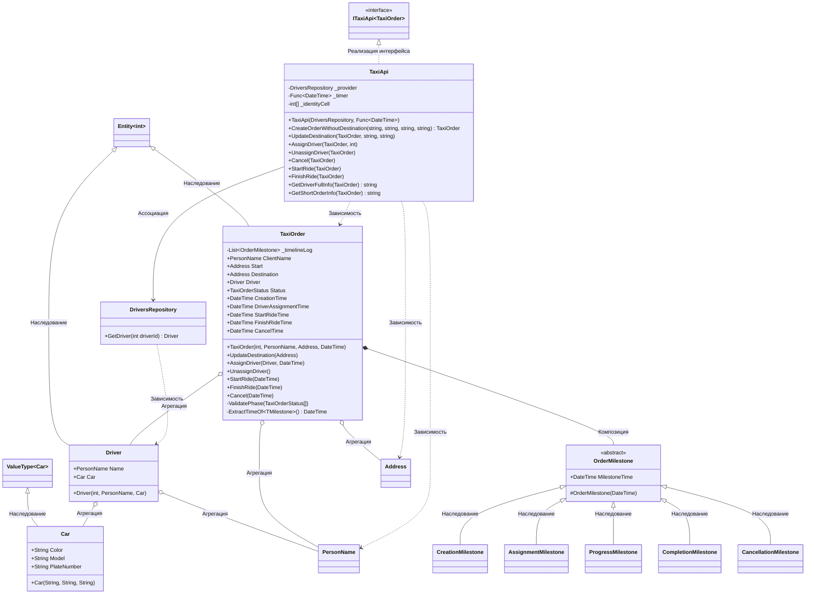

# Практика: TaxiOrder

## 1. Описание предметной области и сущностей
Данный проект представляет собой реализацию API заказа такси.    
**TaxiOrder** - главный класс, который управляет всем жизненным циклом заказа. Содержит в себе данные о клиенте, маршруте, водителе и статусе поездки    
**Driver** - класс, который предстиавляет сущность водителя в системе. Имеет свой Id    
**Car** - класс, который описывает автомобиль(цвет, модель, номер)    
**PersonName** - класс, который обрабатывает ФИО клиентов    
**Address** - класс, который хранит в себе параметры точек маршрута    
## 2. Диаграмма классов (Mermaid)

